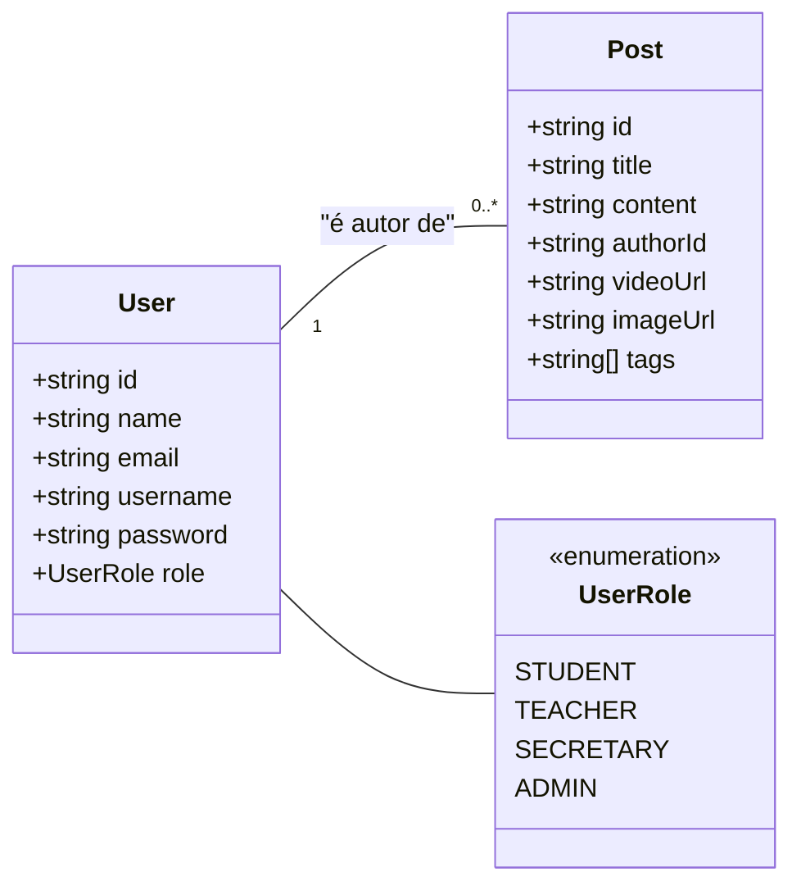
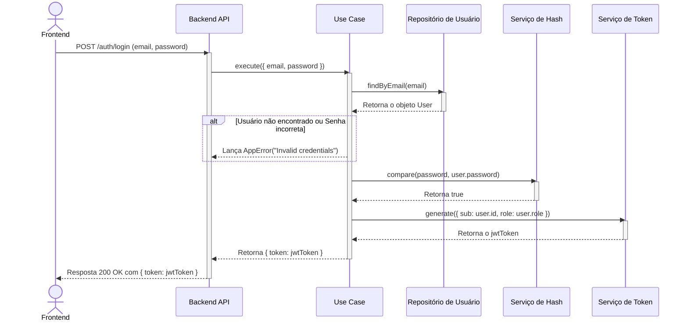

# Arquitetura, Desafios e Experiências do Projeto

Este documento detalha a arquitetura do sistema, as decisões de implementação e os desafios encontrados durante o desenvolvimento do frontend da aplicação de blogging.

---

## 1. Arquitetura do Sistema

A aplicação é dividida em duas partes principais: o **Frontend**, desenvolvido em React, que é responsável pela interface do usuário, e o **Backend**, uma API em Node.js que gerencia os dados e a lógica de negócio.

### Diagrama de Alto Nível

O diagrama abaixo mostra a interação básica entre os componentes do sistema.

```mermaid
graph TD
    A[Usuário] --> B{Frontend (React)};
    B --> C{Backend (Node.js)};
    C --> D[(Banco de Dados)];
```

### Diagrama de Classes do Domínio

Para entender os dados que o frontend manipula, o seguinte diagrama de classes é fundamental. Ele ilustra a estrutura das entidades `User` e `Post` que são consumidas da API.



---

## 2. Integração com a API

A comunicação entre o frontend e o backend é feita através de uma API REST. Um dos fluxos mais importantes é a autenticação do usuário, detalhada abaixo.

### Diagrama de Sequência - Fluxo de Login

Este diagrama mostra a sequência exata de chamadas para autenticar um usuário e obter um token de acesso.



---

## 3. Relato de Experiências e Desafios

*(Esta seção é um template para você preencher)*

Durante o desenvolvimento do projeto, enfrentamos alguns desafios e tomamos decisões importantes que moldaram o resultado final.

### Desafio 1: Proteção de Rotas (Rotas Administrativas)

**Problema:** Precisávamos garantir que apenas usuários autenticados com a permissão de "professor" pudessem acessar as páginas de criação e edição de posts.

**Solução:** Implementamos um componente de ordem superior (Higher-Order Component) chamado `ProtectedRoute`. Este componente utiliza a Context API do React para acessar o estado de autenticação do usuário. Antes de renderizar a página solicitada, ele verifica se o usuário está logado e qual é sua role. Caso o usuário não atenda aos critérios, ele é automaticamente redirecionado para a página de login.

### Desafio 2: Gerenciamento de Estado Global

**Problema:** ... *(Descreva outro desafio, como o gerenciamento do estado de autenticação, o carregamento de dados, etc.)*

**Solução:** ... *(Explique como você resolveu o problema, mencionando as tecnologias usadas, como Context API, hooks customizados, etc.)*

### Decisões de Arquitetura

**Decisão:** Optamos por usar a Context API em vez de uma biblioteca mais complexa como Redux.

**Justificativa:** Para o escopo deste projeto, o gerenciamento de estado se resumia principalmente ao status de autenticação do usuário. A Context API é uma ferramenta nativa do React, mais simples de configurar e suficiente para nossas necessidades, evitando a complexidade e o boilerplate adicionais que o Redux introduziria.
