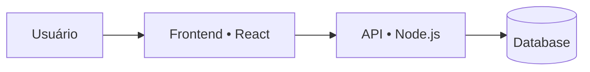
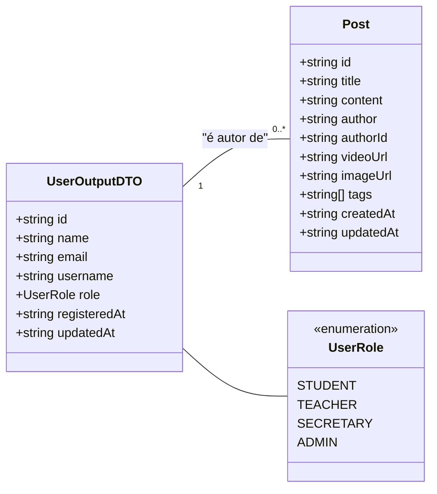
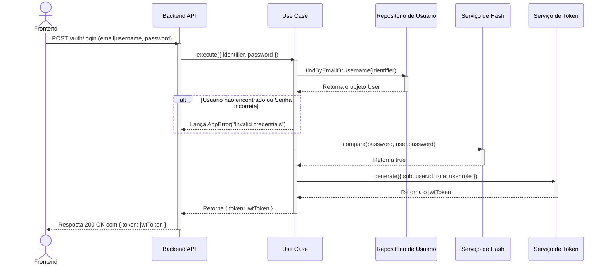
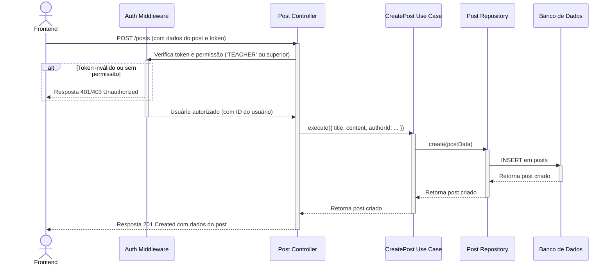
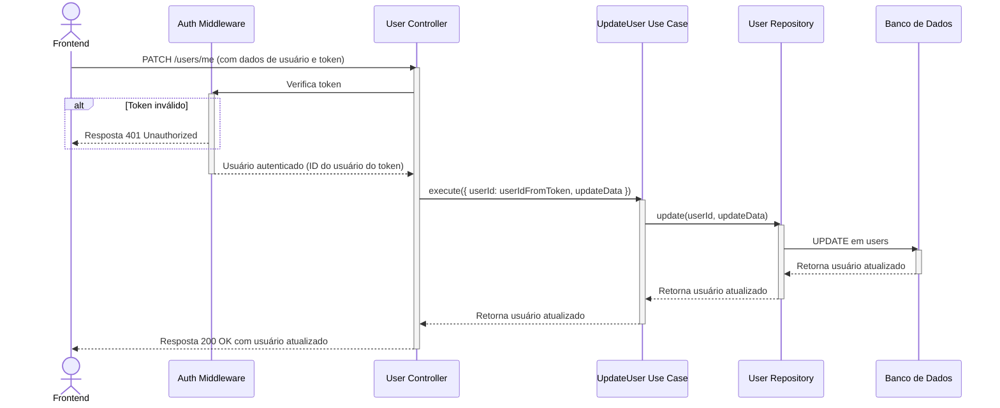

# Arquitetura, Desafios e Experiências do Projeto

Este documento detalha a arquitetura do sistema, as decisões de implementação e os desafios encontrados durante o desenvolvimento do frontend da aplicação **Ponto de Aula** (blog educacional).

---

## 1. Arquitetura do Sistema

A aplicação é dividida em duas partes principais:

- **Frontend**: React + Vite + TypeScript, com UI em Tailwind + shadcn/ui.
- **Backend**: API em Node.js/Express (com JWT, RBAC e persistência em banco de dados).

O frontend segue uma separação por responsabilidades (páginas → componentes → serviços → utilitários), com camadas claras para integração com a API e controle de permissões.

### Estrutura de Pastas (Frontend)

- `src/pages`: telas/rotas (ex.: `Dashboard`, `MyPosts`, `Users`, `Profile`, `PostDetail`).
- `src/components`: componentes compartilhados (`Layout`, `Header`, `Footer`) e feature components (ex.: `components/posts/*`).
- `src/services`: camada de integração com a API (ex.: `post.service.ts`, `user.service.ts`).
- `src/context`: providers de estado global (ex.: autenticação e VLibras).
- `src/hooks`: hooks reutilizáveis (ex.: permissões, paginação, modo de visualização).
- `src/lib`: utilitários (ex.: axios instance, extração de erros, sanitização HTML, policies/RBAC).
- `src/types`: tipos TypeScript compartilhados (DTOs consumidos pela UI).

### Diagrama de Alto Nível

O diagrama abaixo mostra a interação básica entre os componentes do sistema.

### Diagrama de Dados (DTOs Consumidos no Frontend)

Para entender os dados que o frontend manipula, o seguinte diagrama ilustra a estrutura dos principais DTOs consumidos das respostas da API.

Observação: dados sensíveis como `password` **não** são retornados pela API para o frontend.

---

## 2. Integração com a API

A comunicação entre o frontend e o backend é feita através de uma API REST.

No frontend, as chamadas HTTP são centralizadas em uma instância do `axios` (`src/lib/api.ts`) e consumidas por serviços em `src/services/*`.

Pontos importantes da integração:

- **Autenticação**: token JWT no header `Authorization: Bearer <token>`.
- **Normalização de resposta**: o padrão da API é `ApiResponse<T> = { data: T }`.
- **Tratamento de erros**: utilitários em `src/lib/errors.ts` extraem mensagens (incluindo erros de validação com `details`).

### Diagrama de Sequência - Fluxo de Login

Este diagrama mostra a sequência exata de chamadas para autenticar um usuário e obter um token de acesso.

### Diagrama de Sequência - Criação de Post

Este diagrama detalha o passo a passo de como um post é criado, desde a ação do usuário no frontend até a resposta final do backend, incluindo a verificação de autorização.

### Diagrama de Sequência - Edição de Dados do Usuário

Este diagrama detalha o fluxo para um usuário editar seus próprios dados ou senha.

---

## 3. Relato de Experiências e Desafios

Durante o desenvolvimento do projeto, enfrentamos alguns desafios e tomamos decisões importantes que moldaram o resultado final.

### Desafio 1: Proteção de Rotas e Autorização

**Problema:** Era necessário proteger rotas e ações de acordo com autenticação e perfis (roles), garantindo:

- Qualquer usuário autenticado pode **ler** posts (incluindo a página de detalhe).
- Apenas `ADMIN`, `SECRETARY` e `TEACHER` podem acessar telas de **gestão de posts** (criar/editar e “Meus posts”).
- Apenas `ADMIN` e `SECRETARY` podem acessar **gestão de usuários**.

**Solução:** Criamos o componente `ProtectedRoute` que:

- Bloqueia acesso quando não há usuário autenticado (redireciona para o login).
- Quando há `allowedRoles`, exibe uma tela de “Acesso negado” (sem quebrar a navegação) se o perfil não for permitido.

Além disso, para ações dentro de componentes (ex.: mostrar/ocultar botões de editar/excluir), usamos um controle fino via `policies` (`src/lib/policies.ts`) + hook `useCan`.

### Desafio 2: Comunicação com a API e Gerenciamento de Estado Assíncrono

**Problema:** A aplicação depende inteiramente de dados vindos de uma API externa. Era preciso criar uma forma organizada e reutilizável de fazer requisições (GET, POST, PUT, DELETE), além de gerenciar os diferentes estados da interface durante essas chamadas (carregando, sucesso, erro).

**Solução:** Centralizamos a comunicação com a API em uma camada de serviço (`src/services`) e uma instância do `axios` (`src/lib/api.ts`) com interceptors para:

- anexar o token JWT automaticamente nas requisições autenticadas;
- padronizar o consumo do `ApiResponse<T>`;
- ajudar no tratamento de `401` (sem causar efeitos colaterais indevidos em fluxos como “trocar senha”).

Na UI, mantivemos um padrão consistente: `loading`, `error`, `emptyMessage` e toasts para feedback ao usuário.

### Desafio 3: Gerenciamento de Estado Global vs. Local

**Problema:** Em uma aplicação React, é preciso decidir quais informações devem ser globais (acessíveis por toda a aplicação) e quais devem ser locais (restritas a um componente ou página). Uma má decisão poderia levar a uma aplicação lenta e complexa.

**Solução:** Adotamos uma abordagem pragmática:

- Estado global: autenticação (token + usuário), tema (claro/escuro) e VLibras.
- Estado local: listas, filtros e formulários por tela, com hooks customizados quando há ganho real (ex.: `usePagedPosts` para paginação/filtro no dashboard).

Assim, evitamos a complexidade desnecessária de bibliotecas externas de estado global, mantendo a base simples e sustentável.

### Desafio 4: Conteúdo Rico com Segurança (Rich Text)

**Problema:** O conteúdo do post precisava permitir formatação (títulos, listas, links, etc.), sem abrir brechas para XSS.

**Solução:** Adotamos um editor WYSIWYG (`react-quill-new`) para criação/edição, salvando o conteúdo como HTML. Na leitura, o HTML é **sanitizado** (`DOMPurify`) antes de ser renderizado, garantindo segurança. Para manter os cards enxutos e consistentes, a listagem usa um “preview” em texto puro (strip de HTML).

### Desafio 5: Acessibilidade (VLibras)

**Problema:** Incluir um atalho de acessibilidade para VLibras, permitindo ao usuário ligar/desligar, de forma consistente (incluindo mobile).

**Solução:** Criamos um provider + hook e um toggle fixo no rodapé. A ativação/desativação recarrega a página para garantir inicialização correta do widget.
